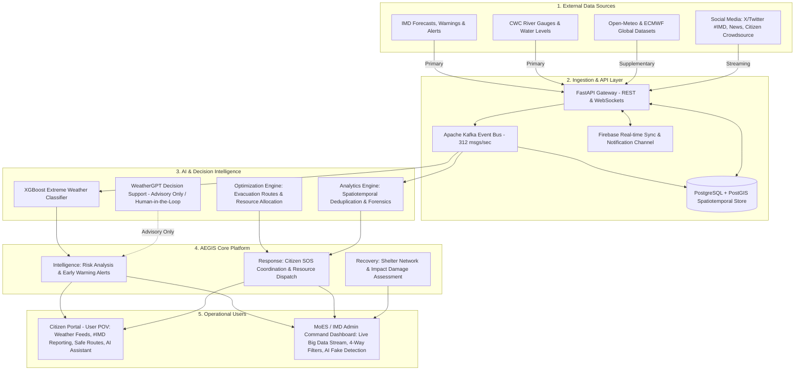

# 🛠️ AEGIS: Technical Architecture & Big Data Specification

**Project Name:** AEGIS — National Weather Big Data Analytics Platform  
**Problem Statement ID:** SIH26069  
**Organization:** Ministry of Earth Sciences (MoES) / Ministry of Education's Innovation Cell (MIC)  
**Lead Evaluator / Problem Creator:** Sarim Moin  
**Core Objective:** Design and develop a scalable National Weather Big Data Analytics Platform capable of ingesting, classifying, verifying, deduplicating, and visualizing multi-source weather data across India in real-time.

---

## 📐 5-Tier System Architecture (As per Official SIH Submission)

---

## 📊 Comprehensive Technology Stack Matrix

| Layer / Subsystem | Primary Technology | Version / Specification | Role in AEGIS Platform |
| :--- | :--- | :--- | :--- |
| **API & Ingestion Gateway** | `FastAPI (Python)` | v0.110+ | High-throughput async ingestion engine (`/api/v1/weather/*`), streaming endpoints, CORS middleware. |
| **Stream Processing Bus** | `Apache Kafka` (simulated pipeline) | v3.6+ / 312 msgs/sec | Partitioned message queues for `#IMD` tweets, citizen feeds, Doppler radar telemetry. |
| **Spatiotemporal Database** | `PostgreSQL + PostGIS` | v16 / PostGIS 3.4 | Geospatial indexing (`ST_DWithin`, `ST_Point`), historical climate records, shelter coordinates. |
| **AI Misinformation Detection** | `Multimodal AI Forensics` | Python / XGBoost + NLP | 3-Pillar verification: NLP sensationalism scoring, reverse-image EXIF forensic lookup, radar cross-check. |
| **Weather Risk Model** | `XGBoost Risk Classifier` | Scikit-learn / XGBoost 2.0 | Multi-hazard severity classification across the 7 official MoES categories. |
| **Generative Decision Support**| `WeatherGPT / Groq LPU` | Llama 3.3 70B Versatile | Sub-second disaster triage explanation, multilingual advisory generation (human-in-the-loop). |
| **Real-Time Cross-Sync** | `Firebase Real-time DB & LocalStorage` | Web SDK v10 Compat | Low-latency state synchronization across Citizen and Admin portals. |
| **Mapping & GIS Engine** | `Leaflet.js & Leaflet.heat` | v1.9.4 & v0.2.0 | National weather grid, satellite tiles, Musi river flood polygons, animated route polylines. |
| **Visual Analytics** | `Chart.js` | v4.4 CDN | 24-hr SOS volume trends, MoES category breakdown, stream ingestion velocity monitors. |
| **Frontend Architecture** | `HTML5 & Modern CSS3` | Vanilla Zero-Framework | High-performance 60 FPS glassmorphic UI, responsive across mobile, desktop, and emergency control rooms. |

---

## 🌟 7 Official MoES Event Categories Implemented

AEGIS natively structures all ingested feeds according to the Ministry of Earth Sciences taxonomy:
1. **🌧️ Rainfall:** Precipitation rate (mm/h), flash rain detection, cloudburst monitoring.
2. **⚡ Thunderstorm:** Lightning strikes, atmospheric instability index, Kalbaishakhi squalls.
3. **🌊 Flooding:** River gauge thresholds (Musi, Brahmaputra), urban waterlogging, breached causeways.
4. **🌡️ Heatwave:** Max ambient temperature (°C), Loo wind warnings, heat index thresholds.
5. **🌫️ Fog:** Horizontal visibility (<150m), airport CAT-III operations disruption.
6. **🌪️ Dust Storm:** Particulate mass (PM10), wind gusts, arid zone convective dust walls.
7. **💨 Strong Wind:** Beaufort scale gale velocity (km/h), structural hazard alerts.

---

## 🛡️ AI Fake Report & Misinformation Quarantine Protocol

To solve the critical hackathon challenge of social media rumors during disasters:
* **NLP Sensationalism Analysis:** Analyzes lexical sentiment and clickbait patterns (e.g. "CATASTROPHIC 50 FEET TSUNAMI").
* **Reverse-Image Forensic Match:** Extracts image perceptual hash (`pHash`) and EXIF metadata to flag recycled images from past years.
* **Doppler Radar Cross-Check:** Verifies if the reported GPS coordinates had corresponding radar reflectivity (dBZ) at that timestamp.
* **Admin Quarantine Workflow:** Suspicious posts are flagged with a low Trust Score (e.g. `14%`) and quarantined in the MoES Admin console for human-in-the-loop review.

---

**AEGIS Team — Problem Statement SIH26069 Submission**  
*National Weather Big Data Analytics Platform • Ministry of Earth Sciences*
